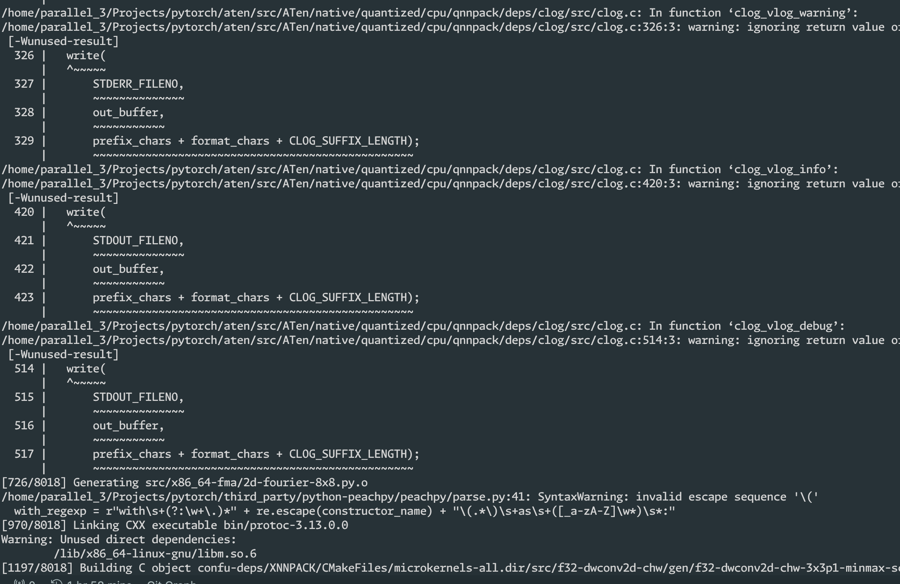

# Experiment-Final - ML Environment 部署过程记录

# To Collaborators: 这个版本是简略版，可能需要补充的地方用加粗的方括号 `[]`表示, ASK ChatGPT may help a lot (doge)

**作者兼参与人员**：并行课程第三组所有小组成员

## 安装 Conda

### [为什么使用Conda]

**[Conda的背景 和 方便之处（个人感觉隔离了运行环境，提供了沙箱，从而满足不同项目的需求etc）]**

按照 [Download Now | Anaconda](https://www.anaconda.com/download/success) 的要求，安装的方式是通过 Installer，这在 Linux 下通过 bash 脚本实现。

### 下载 Anaconda 的Linux安装脚本

由于服务器限制，我们只能连接到其CLI，无法通过运行在GUI的浏览器访问 Anaconda 官网。

幸好，`curl` 可以帮我们解决这个问题。只需要运行 `curl -L -O $URL` 即可。

我们从 Anaconda 的官网知道，对应操作系统和架构的下载链接为：https://repo.anaconda.com/archive/Anaconda3-2024.10-1-Linux-x86_64.sh。

于是，我们在远端服务器上运行 `curl`:

```bash
mkdir -p ~/Downloads && cd ~/Downloads
curl -L -O https://repo.anaconda.com/archive/Anaconda3-2024.10-1-Linux-x86_64.sh
```

**[对上面的命令的解释]**

### 执行安装脚本

**[对下面的命令的解释]**

```bash
chmod u+x Anaconda3-2024.10-1-Linux-x86_64.sh
bash Anaconda3-2024.10-1-Linux-x86_64.sh
```

运行脚本：


可以看到，脚本成功运行：


最后，Anaconda 运行脚本提示是否自动初始化，输入 `yes` 确定


### 首次安装后激活当前 shell session 的 Conda 环境

运行以下命令来激活环境：

```bash
source ~/anaconda3/bin/activate
```


从上面的截图可以看到，bash 的开头出现了 `|base|`，**[说明 base 环境是什么，与Conda的联系，bash出现了这个代表了什么]**，因此 Conda 安装成功。

## 编译 PyTorch

**[编译的原因：不仅是课程的要求，而且能锻炼动手能力和侦错能力，获取更好的性能 etc]**

### 创建新的Conda 虚拟环境

由于 PyTorch 需要依赖于 Triton 和 matplotlib，我们将 Python 设置到 3.12，并在创建脚本之初安装 matplotlib (triton will be installed later)

```bash
conda create -y -n "torch" python=3.12 matplotlib
```

**[解释上面的脚本]**


运行脚本后，Conda开始下载依赖的包：


安装完成后我们可以看到，Conda 提示我们需要手动激活环境，运行提示的命令手动激活即可：


**[可以添加对 conda activate 和 conda deactivate 命令的解释]**

在 bash 的输出看到了 `|torch|` ，表示虚拟环境安装完成，并且成功进入新的虚拟环境。

### 从 GitHub Clone 源代码

为了编译 PyTorch，我们需要从 GitHub 上下载源代码。由于 PyTorch 引用了第三方仓库，因此下载源代码的 zip 或许不能满足我们的要求。因此，使用 `git clone` 以下载源代码。

```bash
git clone --recursive https://github.com/pytorch/pytorch
```


**[对以上命令的解释]**

运行后，可以看到 git 在从远程拉取源代码：


### 安装编译需要的依赖

在拉取源代码后，编译源代码之前，安装 PyTorch 的编译时依赖是很有必要的。这里需要的依赖有 CMake Ninja，以及来源于 PyPi 的 一系列 Python 包，这可以通过下面的命令安装：

```bash
cd pytorch/ && conda install make ninja && pip install -r requirements.txt
```

**[对上面的命令的解释]**


运行后，Conda 会提示是否确认安装，输入 y 进行确认：


此外，对于 Linux 来说，PyTorch 还需要 Python 的依赖 mkl-static mkl-include，这里使用 pip 安装即可：

```bash
pip install mkl-static mkl-include
```

**[对上面的命令的解释]**

可以看到如下运行结果，提示 Successfully Installed，说明安装完成。


#### 通过源代码安装 Triton

正如[上文](#创建新的Conda 虚拟环境)中提到，Triton会在这部分安装，以确保 PyTorch 的功能完整性。[官方文档](https://github.com/pytorch/pytorch?tab=readme-ov-file#install-dependencies)提到，需要运行如下命令安装 Triton：

```bash
make triton
```

**[对上面的命令的解释]**

运行结果如下：


提示 Successfully Installed，说明 Triton 的安装完成。

### 进入Screen

**[详细解释：在编译之前要先进入Screen，因为编译时间很长，中途如果与服务器断开连接，那么只能重新编译，很麻烦，通过Screen可以解决这个问题 ......]**

运行如下命令：

```bash
screen
```


即可进入 Screen。

进入Screen后，由于shell 的环境被重置，因此需要重新激活 Conda 虚拟环境：


### 设置编译相关的环境变量

首先，我们希望使用新的 [C++ ABI](https://gcc.gnu.org/onlinedocs/libstdc++/manual/using_dual_abi.html) 编译，所以，首先设定如下环境变量：

```bash
export _GLIBCXX_USE_CXX11_ABI=1
```

然后，设置额外的环境变量指定安装路径

```bash
export CMAKE_PREFIX_PATH="${CONDA_PREFIX:-'$(dirname $(which conda))/../'}:${CMAKE_PREFIX_PATH}"
```

**[对上面的命令的解释]**


### 开始编译

最后，执行如下命令开始编译：

```bash
python setup.py develop
```


运行结果如下：



说明正在通过C编译器编译。编译过程大约1个小时，需要的内存很大（大约90G）而宿主机的内存不够，需要Swap内存，相比直接访问内存很影响编译速度，所以需要耐心等待。

等待大约1小时后，会显示如下输出：


这时候，编译就完成了。

## 测试程序运行结果

首先，我们需要停止并且退出当前的 screen session，使用 `Ctrl+A, D` （按顺序按下）退出即可。

退出后，激活Torch虚拟环境环境进入到源代码目录，并且运行 `transformer_main.py`：


### 修复 `ImportError`

发现Error：

```bash
ImportError: /home/parallel_3/anaconda3/envs/torch/bin/../lib/libstdc++.so.6: version 'GLIBCXX_3.4.30' not found
```

通过搜索[资料](https://stackoverflow.com/a/72736003/18909642)发现，这是因为当前Conda的虚拟环境缺少最新版本的 GLIBC，通过 conda 安装最新版本的 GLIBC 即可：


### 最终测试

重新运行

```bash
python src/transformer_main.py
```

得到的运行结果如下：


运行 `test_preprocess_text.py`:

```bash
python src/test_preprocess_text.py
```


结果都正常，说明安装成功。

## [结论/心得]

**[按照上面的实验过程，随便写一点填充一下]**