# Experiment-Final - 性能优化报告

# To Collaborators: 这个版本是简略版，可能需要补充的地方用加粗的方括号 `[]`表示, ASK ChatGPT may help a lot (doge)

**作者兼参与人员**：并行课程第三组所有小组成员

## 准备性能测试工具

**[[cProfile](https://docs.python.org/3/library/profile.html#module-cProfile)是Python内置的性能测试工具，说明它的背景和优势]**

**[[SnakeViz](https://jiffyclub.github.io/snakeviz/)是性能的可视化工具，搭配Python的cProfile输出的可视化文件，可以实现运行中各个函数数据的可视化 ...]**

这里，为了要使用SnakeViz可视化cProfile的输出结果，我们需要使用Python的cProfile的Command Line Interface:

```bash
python -m cProfile -o 'log/program.prof' src/transformer_main.py
```

**[解释上面的命令]**

运行结果为：

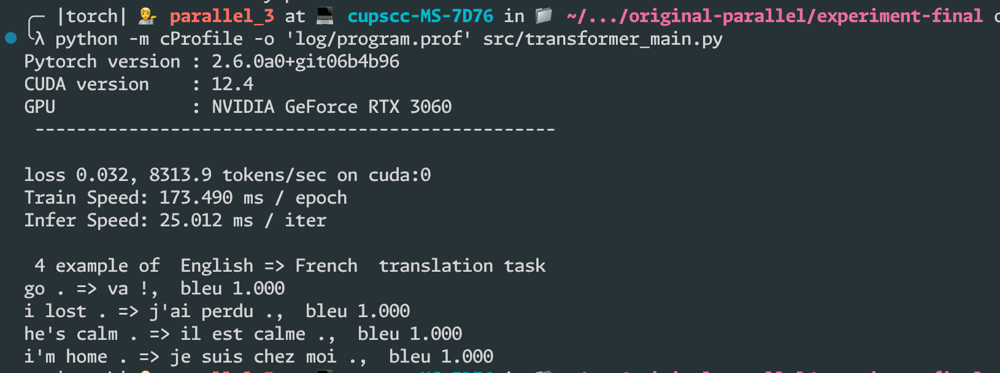

此时，可以在 log 文件夹内找到 program.conf，这是一个二进制文件，记录了每个函数的运行时间。

接下来，需要使用 SnakeViz 可视化 program.conf 文件，方便分析运行时间。

首先，我们需要安装 snakeviz 这个 Python 包：

```bash
python -m pip install snakeviz
```

安装完成后，我们可以使用 snakeviz 可视化查看运行时间了：

```bash
snakeviz log/program.conf
```

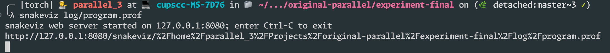

可以看到，SnakeViz运行了一个网页服务器，我们可以在VSCode自动将远程的8080端口转发到本地后，通过本地的浏览器访问 `127.0.0.1:8080` 来可视化的查看程序各个函数的具体运行时间，详细内容请参考下一节。

## 尚未优化时的性能

通过SnakeViz运行后，通过访问浏览器，我们可以得到如下的可视化运行时间：

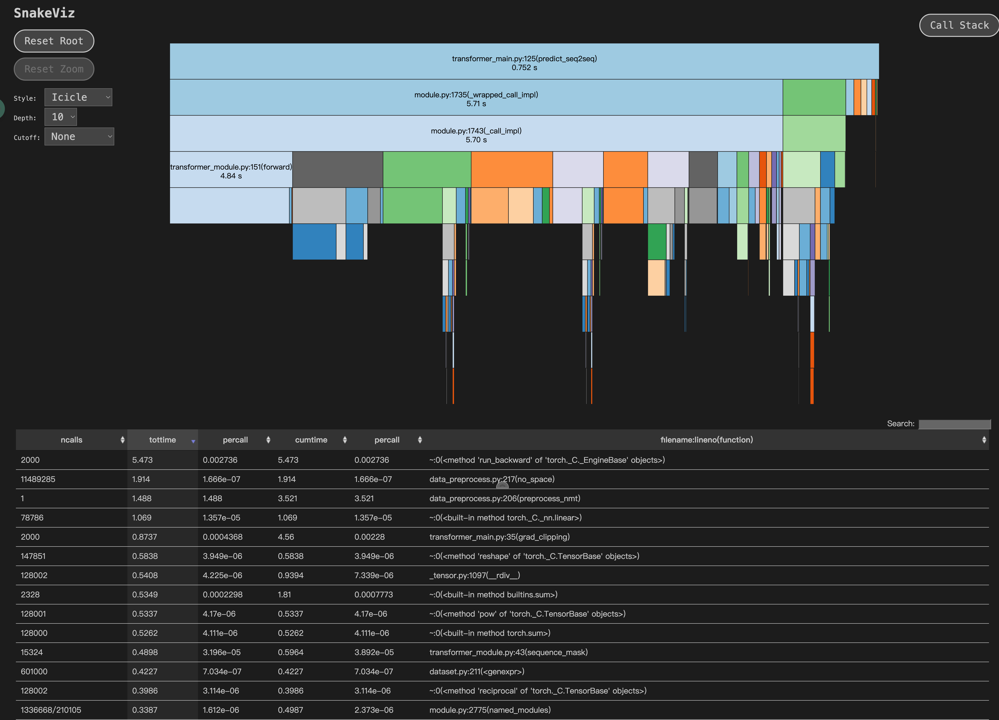

仔细观察后不难发现，其中有几个函数有性能瓶颈:

- data_preprocess.py:217(no_space) 这个函数总共花了1.9秒的时间执行。

  

- data_preprocess.py:206(preprocess_nmt)  这个函数总共花了3.5秒的时间执行。

  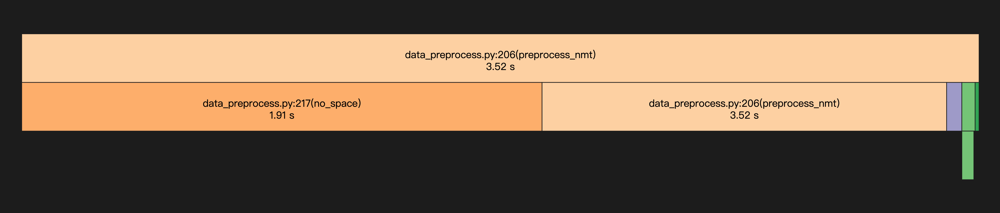

- transformer_main.py:35(grad_clipping) 这个函数总共花了4.5秒的时间执行。

  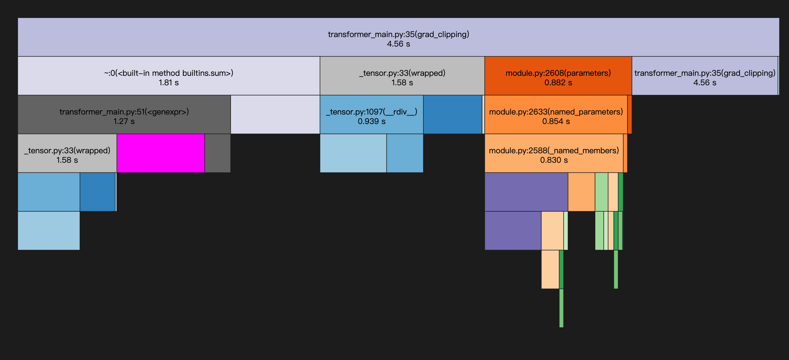

因此，我们的优化主要着力点在这三个函数上。

**[这部分的详细内容，请参考 样例Transformer模型的性能分析，最终版的时候请删除这个括号范围内的内容]**

## 使用 `torch.compile` 加速性能

### 添加 `torch.compile`语句，并且调整精度

无论需要优化什么函数，我们首先发现，在 `transformer_main` 的源代码中，缺少 `torch.compile`，因此我们的首要的任务是让程序运行时编译模型，从而提高运行速度。

**[使用 `torch.compile` 的原因，以及能带来什么样的优势（源代码 `torch.compile` 的对象是`torch.nn.Module`，编译完了后会为`torch.nn.Module` 以及它的继承类 `EncoderDecoder` 带来什么样的性能提升）Reference at [Here](https://pytorch.org/tutorials/intermediate/torch_compile_tutorial.html)]**

要使用 torch.compile，只需要在代码中对 EncoderDecoder 模型使用即可：

```python
    # 编译模型以提高性能
    net = torch.compile(net)
```

然后，再次运行 `transformer_main.py`:

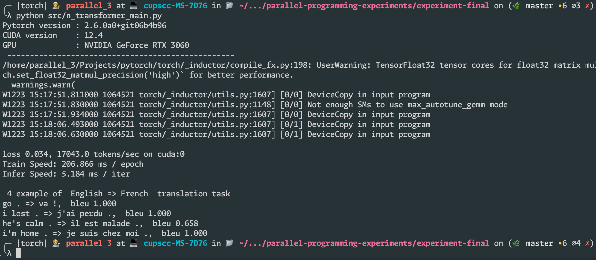

发现输出中提示，如果需要更好的性能，需要设置 `torch.set_float32_matmul_precision("high")`。

于是，代码的变化为：

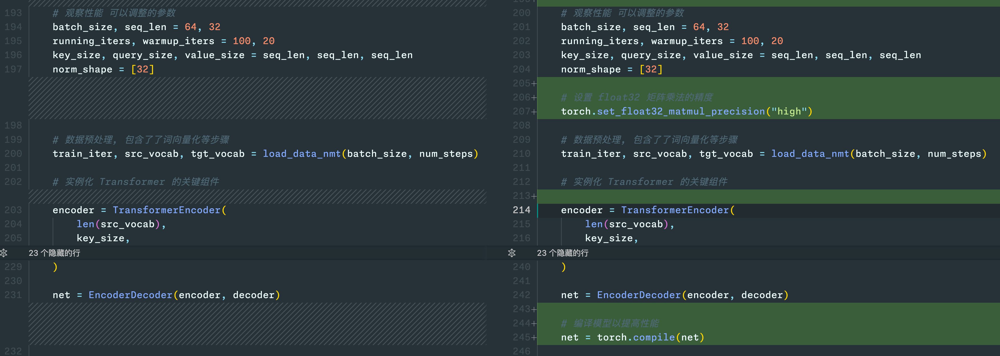

### 性能对比

这是原来的运行时间占比：

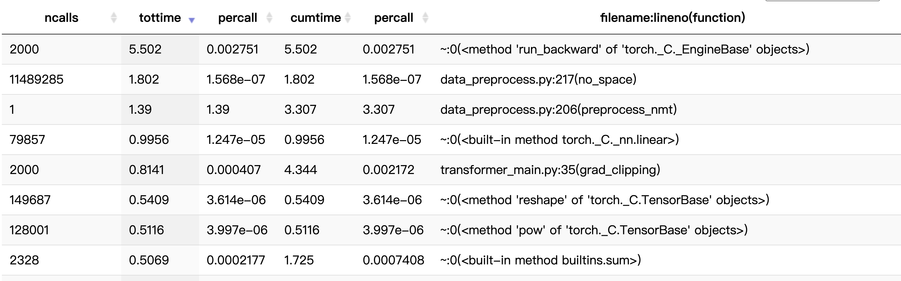

增加了两条语句后，运行时间的占比变为：

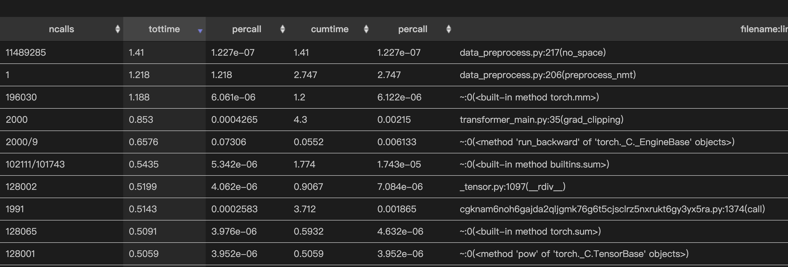

我们发现 `~:0(<method 'run_backward' of 'torch._C._EngineBase' objects>)` 的运行时间大幅提升，从5.5s变为0.6s，

**[这种提升说明了torch.compile和精度变化的什么作用，为什么]**

## 优化 `no_space` 函数

在上图中可以看到，运行时间占比最长的函数变成了 `data_preprocess.py:217(no_space)`，以及调用`no_space` 的`preprocess_nmt` 。首先，我们查看这两个函数总共的运行时间和调用关系：

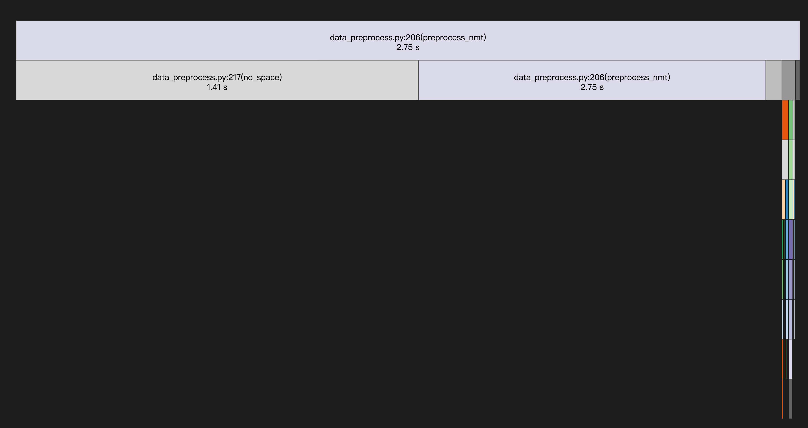

然后，我们再查看这个函数的具体代码：

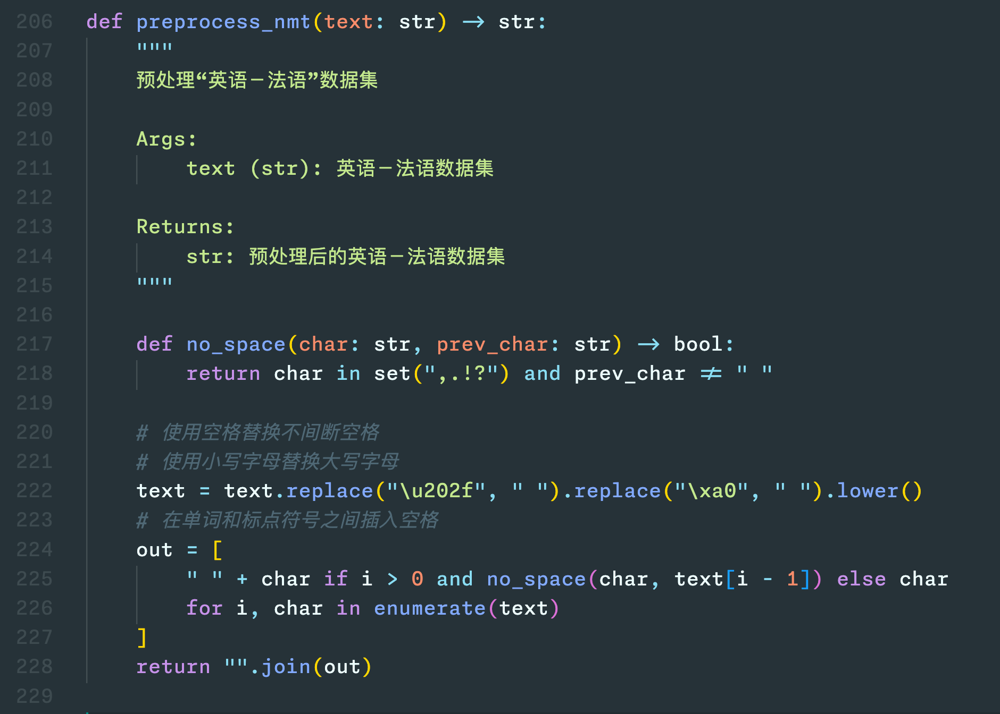

**[Python 自带的 set 开销很大（具体是为什么，例如每次调用no_space都需要创建或者销毁set，非常影响性能...）]**

**[于是使用 frozenset 替代 set（frozenset的背景，以及它有哪些优势），并且将这个 frozenset 放到 no_space 的外面，减少创建和销毁的时间...]**

下面给出代码的具体变化：

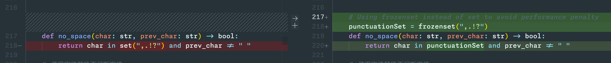

然后，运行程序，查看 no_space 的性能提升：


相比之前的结果：


我们发现 `no_space` 的运行时间从1.41s 下降到 0.49s，的确有很大的性能提升。

然而，我们发现性能瓶颈仍然落在`preprocess_nmt` 函数上：

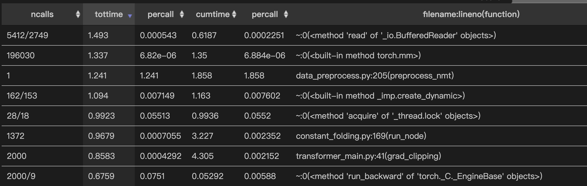

而且其运行时间仍然有显著的1.2s。

再次观察 preprocess_nmt的功能：


发现他的作用只是将文本中间的标点符号中间加一个空格，**[发现这里面不仅 no_space 比较慢，而且构造列表的表达式也很消耗时间和空间，具体说明为什么]**

而我们可以通过完全移除这个函数，只靠后面的 tokenize_nmt 实现相关的功能，如下是目前`tokenize_nmt` 的实现：

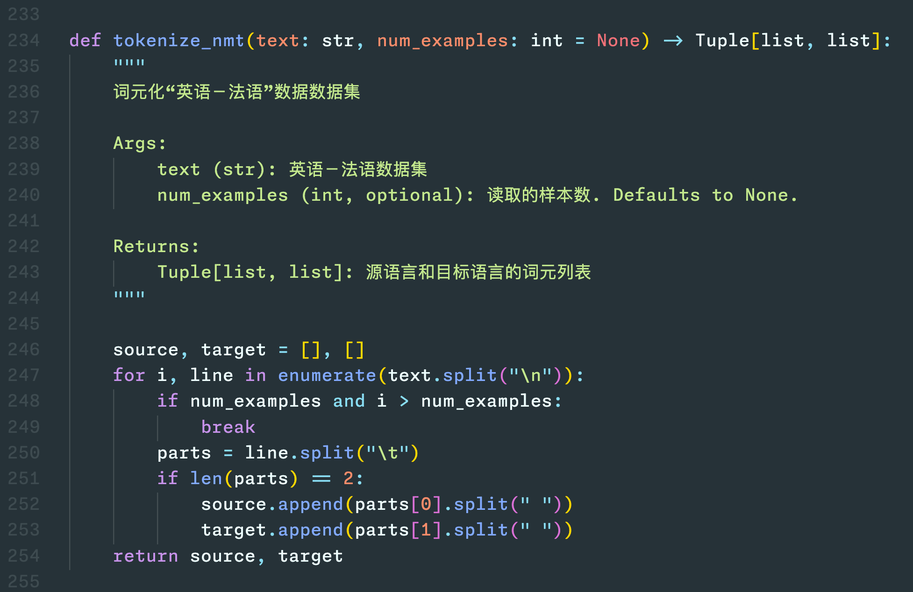

我们可以通过修改后面的`tokenize_nmt`并且放弃前面的`preprocess_nmt` 来提升性能。

## 完全移除 `preprocess_nmt` 函数，并且使用 NLTK 的第三方 Tokenizer

**[考虑完全移除 preprocess_nmt，有几种可能的思路 （使用正则表达式（Regex）匹配让tokenizer在tokenize中顺便干preprocess的事情：发现太复杂 ； 其他思路...，发现性能不行/太复杂/不好维护等等；...）... ]** 

**[最终考虑第三方的 Tokenizer NLTK，兼顾了可维护性以及性能，具体说明(从这个库本身介绍的概括性角度出发)]**

### 安装 NLTK

首先安装 nltk 的包：

```bash
pip install nltk
```

然后，安装 nltk 的数据集，以便后续的 tokenize。 **[nltk需要数据集，为什么]**

运行如下命令，nltk 会将数据集下载到当前虚拟环境的目录下：

```bash
python -m nltk.downloader -d /home/parallel_3/anaconda3/envs/torch/nltk_data all
```

**[解释上述一个命令]**

运行结果如下，可以看到，各种数据集正在被下载到`nltk_data`的目录下：

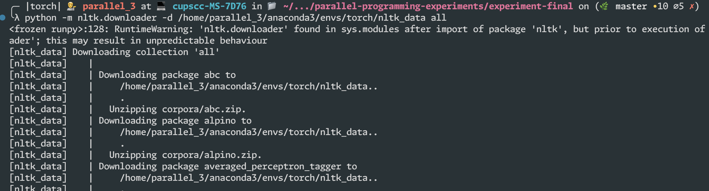

下载完成后，即可使用nltk在`preprocess_nmt` 中进行分词功能。

### 修改相关代码，以取代 `preprocess_nmt` 的功能

于是，我们可以在代码中如此修改，以取代简单的通过空格分词的功能：

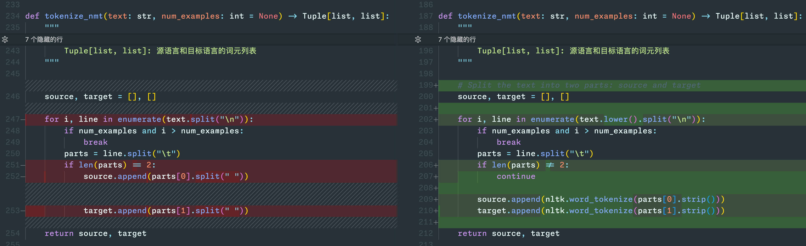

然后，完全移除 `preprocess_nmt`：

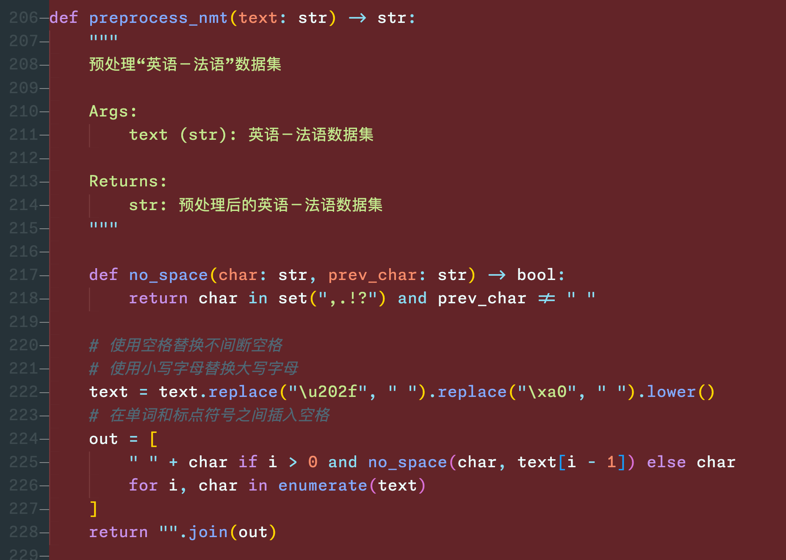

最后，修改 `load_data_nmt` 的逻辑，让他不再调用 `preprocess_nmt`

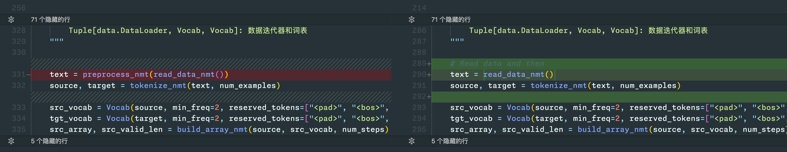

修改代码后，运行代码，并查看各个函数的运行时间：

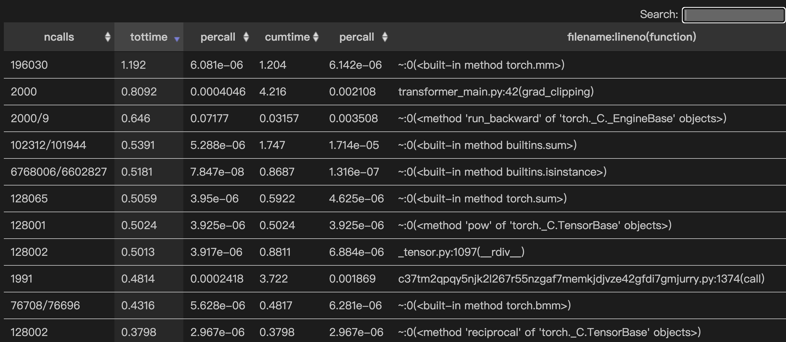

发现，性能瓶颈之一的`preprocess_nmt`已经消失，而，`tokenize_nmt`的耗时也很短：

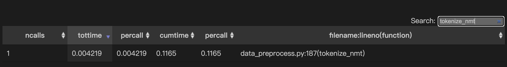

**[使用了NLTK，我们就不再需要预处理，在标点符号之间加空格，具体是为什么，这样为什么可以提升性能（注意这里与这一节的一开始有区别，这边是从代码逻辑的变更前后对比角度出发）]**

## 优化 `grad_clipping`

### 原来的 `grad_clipping` 存在性能瓶颈

即便使用了`NLTK`，我们发现性能瓶颈仍然存在，从下图可以看出：

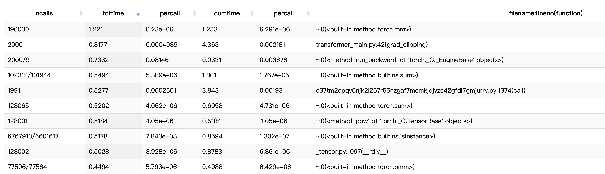

这里，性能瓶颈在 `transformer_main.py:42(grad_clipping)` :

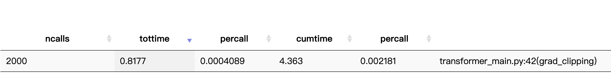

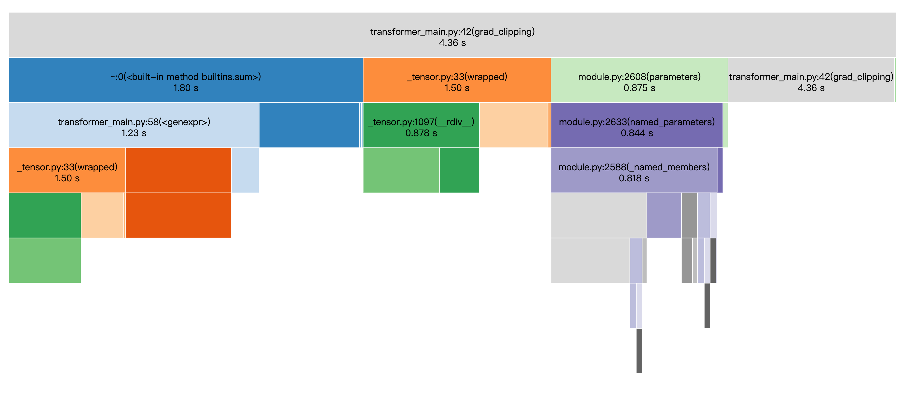

再结合源代码来看：

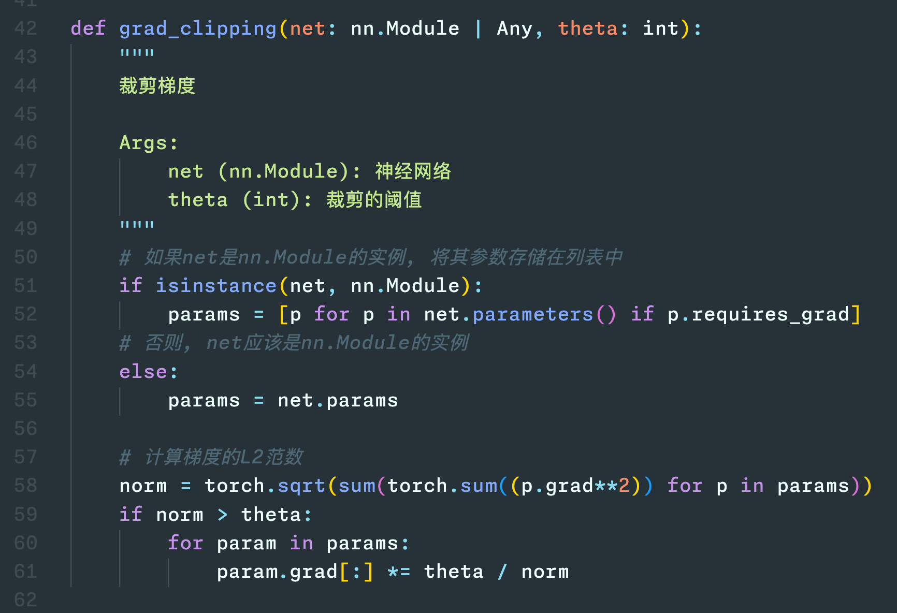

**[可以看到，这个函数的运行时间为4.3秒，非常消耗时间，而其中的sum函数消耗的时间很长，具体是因为什么，结合Python自身来说明]**

### 使用torch自带的 `torch.nn.utils.clip_grad_norm_`优化 `grid_clipping`

**[介绍`torch.nn.utils.clip_grad_norm_`的背景，以及为什么使用这个工具，能优化性能（例如调用了C库来高效计算等等）]**

修改代码如下：

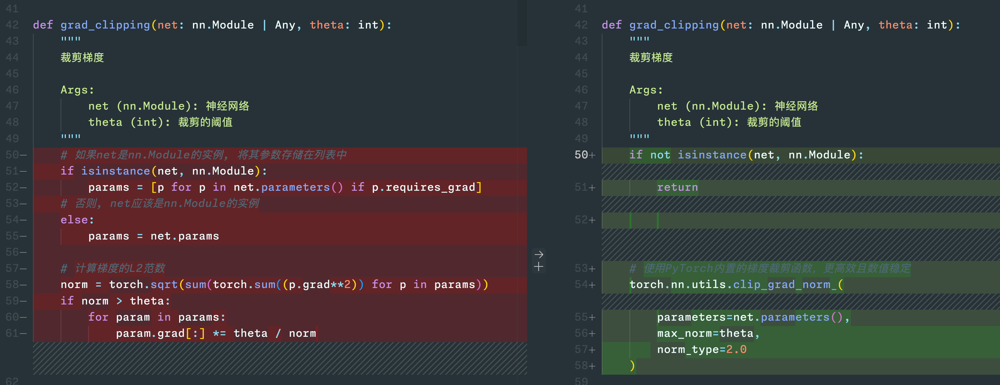

可以看到，性能有大幅度提升，得益于 `torch.nn.utils.clip_grad_norm_`:

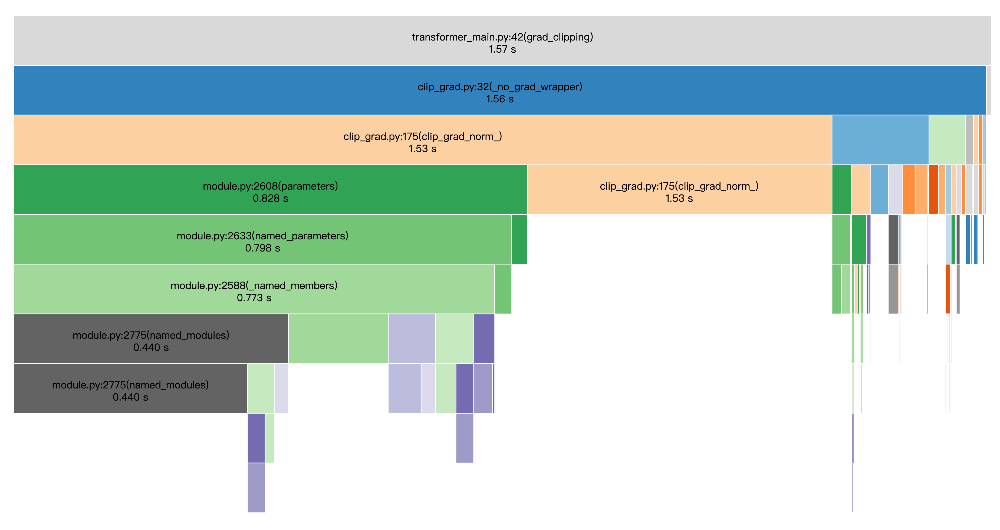

其性能从原来的4.63s降低到1.57s，这证明修改 `grad_clipping` 的确有明显效果。

## [结论/收获]

**[按照上面的实验过程，随便写一点结论或者收获填充一下（借助GPT）]**